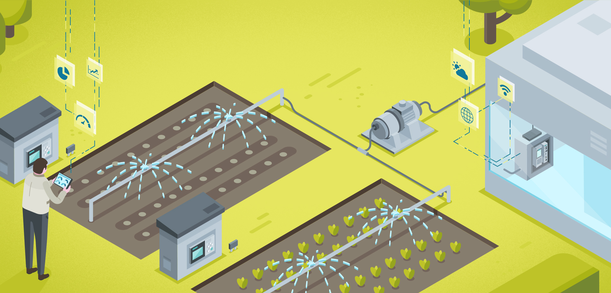
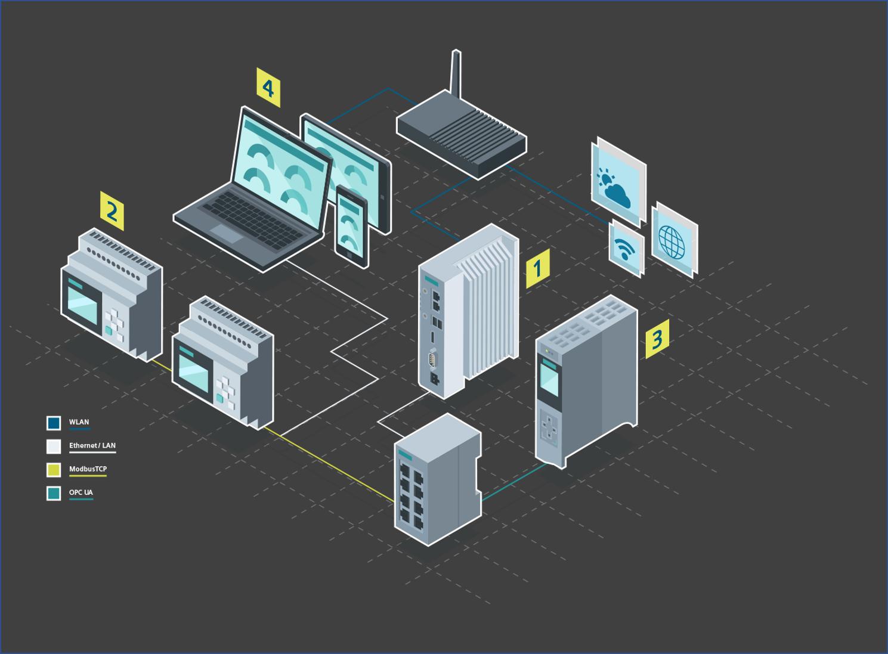

# IOT2050 SmartFarming Application

- [Overview](#overview)
- [Instructions](#instructions)
  - [Requirements](#requirements)
    - [Used hardware](#used-hardware)
    - [Used software](#used-software)
    - [Pre-requisites](#pre-requisites)
   - [Installation](#installation)
     - [Openweathermap](#create-an-account-on-openweathermap)
     - [Prepare LOGOs](#prepare-logos)
     - [Prepare S7-1511C](#prepare-s7-1511c)
     - [Prepare IOT2050](#prepare-iot2050)
  - [Usage](#usage)
- [Contribution](#contribution)
- [Licence and Legal Information](#licence-and-legal-information)

## Overview
This application example shows how to use the SIMATIC IOT2050 to gather weatherdata from the internet, connect to LOGO! via Modbus TCP and connect to an S7-1500 via OPC UA using node-red. All gathered data are displayed on a local node-red dashboard on the IOT2050

### Example Use Case
The soil moisture is recorded with two decentralized LOGO! sensors at different locations and sent to the SIMATIC IOT2050 gateway via Modbus TCP. The IOT2050 obtains the current weather data via the internet and sends this and the sensor data to the SIMATIC S7-1500, which performs the control tasks, via OPC UA.  
The open source software node-red acts as the central development and runtime environment for the gateway functionality of the SIMATIC IOT2050

### Technical Overview

# Instructions
The following steps describe how to run this application example.

## Requirements

### Used Hardware
- 1x S7-1511C 
- 2x LOGO! 8 with some sensors connected to AI1 / AI2
- 1x IOT2050
- 1x SCALANCE Switch

### Used software
- TIA Portal V16
- LOGO! Soft Comfort 
- Win32 Disk Imager
- putty

### Pre-requisites: 
- Knowledge in the handling with LOGO! and LOGO! Soft Comfort
- Knowledge in the handling with S7-1500 and TIA Portal 
- Basic Linux Knowledge
- Account in the Siemens Industry Online Support to download the operating system for the IOT2050

## Installation

### Create an account on openweathermap
This is needed to create an API key to retrieve data from this service via the node-red node

1. Open http://openweathermap.com
2. Click on *Sign in*
3. Click in *Create an Account* when you don't have an account, otherwise sign in with your credentials and skip the *Step 4*
4. Follow the process for creating an account and sign in afterwards
5. Go to *API keys*
6. Either remember the default key or create a new one
7. You will need this key at a later stage

### Prepare LOGOs
1. Open [LOGO! Soft Comfort project](src/Smart_Farming_Example_LOGO.mnp)
2. Download project to the respective LOGO!

### Prepare S7-1511C
1. Open [TIA Portal project](src/Smart_Farming_Example_TIA.zip)
2. Download project to the S7-1511C

### Prepare IOT2050
1. Download Example Image for the IOT2050 from here: https://support.industry.siemens.com/cs/ww/en/view/109780231
2. Follow [*SIMATIC_IOT2050_Setting_up_V1.0.pdf*](docs/SIMATIC_IOT2050_Setting_up_V1.0.pdf) to setup the IOT2050
3. Establish an internet connection (via USB-WiFi dongle or eth1)
4. Open a browser on your PC and open node-red via the URL http://192.168.200.1:1880
5. Go to the *Menu* -> *Manage Palette* -> *Install*
6. Search for *node-red-contrib-modbus* and click on *Install*
7. Search for *node-red-contrib-opcua* and click on *Install*
8. Search for *node-red-contrib-openweathermap* and click on *Install*
9. Search for *node-red-dashboard* and click on *Install*
10. Copy the content of [*flows.json*](src/flows.json)
11. Go to the node-red *Menu* -> *Import* -> *Clipboard* and paste the content of *flows.json*
12. Go to the flow *Weather* and double-click on the *openweathermap* node
13. Paste your *API Key* and click on *Done*
14. Click on *Deploy* to deploy the program

## Usage
1. Open a browser on your PC and open the node-red dashboard via the URL http://192.168.200.1:1880/ui
2. Choose the city you want to read the weather data
3. On the LOGO! display you will see the temperature and pressure value
4. On the S7-1500 the LEDs of the outputs show the current temperature in relation (the higher the temperature is the more LEDs are on)

## Contribution

Thanks for your interest in contributing. Anybody is free to report bugs, unclear documenation, and other problems regarding this repository in the Issues section or, even better, is free to propose any changes to this repository using Merge Requests.

## Licence and Legal Information

Please read the [Legal information](LICENSE.md).
