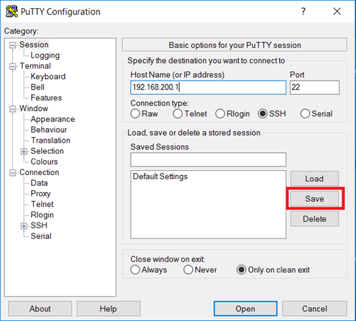
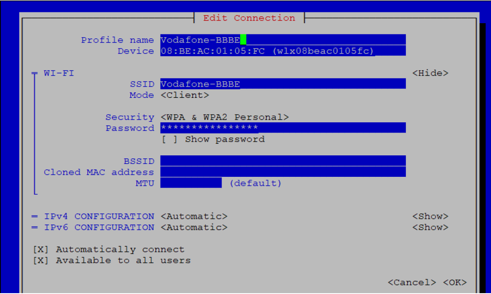
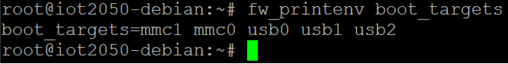

# **Setting up the IOT2050 (V1.2)**

## **Table of contents**

- [**Setting up the IOT2050 (V1.2)**](#setting-up-the-iot2050-v12)
  - [**Table of contents**](#table-of-contents)
  - [**1 Task**](#1-task)
    - [**1.1 Overview**](#11-overview)
  - [**2 Requirements**](#2-requirements)
    - [**2.1 Required Hardware**](#21-required-hardware)
    - [**2.2 Required Software**](#22-required-software)
  - [**3 Operating**](#3-operating)
    - [**3.1 Installing the SD-Card Example Image**](#31-installing-the-sd-card-example-image)
    - [**3.2 First commissioning of the SIMATIC IOT2050**](#32-first-commissioning-of-the-simatic-iot2050)
      - [**3.2.1 Local access**](#321-local-access)
      - [**3.2.2 Remote access with Putty SSH Connection**](#322-remote-access-with-putty-ssh-connection)
      - [**3.2.3 Remote access using UART connection**](#323-remote-access-using-uart-connection)
      - [**3.2.4 Setting up network interfaces**](#324-setting-up-network-interfaces)
      - [**3.2.5 Install new software packages on the SIMATIC IOT2050**](#325-install-new-software-packages-on-the-simatic-iot2050)
    - [**3.3 Change boot order of IOT2050**](#33-change-boot-order-of-iot2050)
      - [**3.3.1 With Example Image V1.0.2 / V1.1.1**](#331-with-example-image-v102--v111)
      - [**3.3.2 As of Example Image V1.2.1**](#332-as-of-example-image-v121)
      - [**3.3.3 Using UART connection**](#333-using-uart-connection)
      - [**3.3.4 Skip eMMc as of firmware V1.2.1**](#334-skip-emmc-as-of-firmware-v121)
  - [**4 Related links**](#4-related-links)
  - [**5 History**](#5-history)

---

## **1 Task**

### **1.1 Overview**

**Introduction:** This Setting Up shows how to set up the SIMATIC IOT2050 with a SD-Card image (“Example Image”) provided through the Siemens Industry Online Support.

**Goals:** After working through this document, you know how to

- Locally access to the SIMATIC IOT2050
- Get remote access to the SIMATIC IOT2050
- Change the IP-Address of the SIMATIC IOT2050
- Install software on the SIMATIC IOT2050
- Change the boot order of an IOT2050

---

## **2 Requirements**

### **2.1 Required Hardware**

This chapter contains the hardware required for this Setting up.

**SIMATIC IOT2050:** Two different versions of the SIMATIC IOT2050 are available. However, this Setting Up will only use the SIMATIC IOT2050 Basic (6ES7647-0BA00-0YA2) as basis for all examples, but it is valid for SIMATIC IOT2050 Advanced (6ES7647-0BA00-1YA2) as well.

**SIMATIC IOT2050 Basic (6ES7647-0BA00-0YA2) Hardware Overview:**

- TI SOC AM6528 GP Dual Core
- 1 GB RAM (DDR4)
- RTC without battery
- SD card slot
- SIM card slot
- mPCIe card slot
- 2 Ethernet interfaces 100/1000 Mbps
- 2 USB Type A
- 1 COM interface (RS232/422/485)
- Arduino Uno R3 interface
- 1 DisplayPort 1.1 A

**SIMATIC IOT2050 Advanced (6ES7647-0BA00-1YA2) Hardware Overview:**

- TI SOC AM6548 HS Quad Core
- 2 GB RAM (DDR4)
- Battery buffered RTC
- SD card slot
- SIM card slot
- mPCIe card slot
- 16 GB eMMc (internal memory)
- 2 Ethernet interfaces 100/1000 Mbps
- 2 USB Type A
- 1 COM interface (RS232/422/485)
- Arduino Uno R3 interface
- 1 DisplayPort 1.1 A

Figure 2-1

Table 2-1

|No.|Description|
|:-:|-|
|1|Ethernet interfaces 100/1000 Mbps|
|2|USB Type A|
|3|DisplayPort 1.1 A|
|4|COM interface (RS22/422/485)|
|5|Power supply connector|
|6|USER button, programmable|
|7|LED display|
|8|RESET button for the CPU|
|9|Markings for mini PCIe installation accessory|
|10|Shield cover|
|11|Top housing|  

**Micro-SD Card:** SIMATIC IOT2050 can be operated with a Debian based Linux Operating System, which requires the use of a Micro-SD Card.
The requirement for using SIMATIC IOT2050 with Debian based Linux Operating System is a Micro-SD Card with storage capacity from 8GB up to 32GB.

**Engineering Station:** To work with the SIMATIC IOT2050 an Engineering Station is required. In this Setting Up a PC with Windows 10 Enterprise is used. The Engineering Station has to include the following Interfaces:

- SD Card Slot
- Ethernet Port

**Ethernet Cable:** For an Ethernet Connection between the Engineering Station and the SIMATIC IOT2050 in order to establish a SSH connection and to download the Eclipse projects an Ethernet cable is required.

**UART cable (optional, but recommended):** To establish a serial connection to the IOT2050 in order to get into the u-boot shell a 3.3V USB-UART cable is needed. There are many hardware possibilities, good experiences were made with [this cable](https://de.rs-online.com/web/p/entwicklungstool-zubehor/0429307).

**DisplayPort Cable (Male-Male) and Monitor:** If you would like to have local connection to the SIMATIC IOT2050, you need to have DisplayPort Cable, a monitor that supports DisplayPort. As alternative an **active** DP-HDMI converter can be used.

**Keyboard:** If you would like to have local connection to the SIMATIC IOT2050, you need to have a keyboard connected to IOT2050.

**Power supply:** In order to run the SIMATIC IOT2050 a power supply is required.
This power supply has to provide between 12 and 24V DC.

### **2.2 Required Software**

This chapter contains the software required for this Setting up

**Micro-SD Card Example Image:** To use the full functionality of the SIMATIC IOT2050 a SD-Card Example Image with a Debian based Linux Operating System is necessary to be installed. This Image is provided through the Siemens Industry Online Support.
The download and information about compatibility can be found [here](https://support.industry.siemens.com/cs/document/109741799).

**ssh Client:** To get remote access to the SIMATIC IOT2050 software is required.
In this document “PuTTY” is used. With this software it is possible to establish a connection to different devices for example via Serial, SSH or Telnet.

The “PuTTY” software can be downloaded [here](https://www.putty.org/).

> NOTE: Instead of PuTTY you also can use Windows 10 or Linux built-in ssh client.

**Win32 Disk Imager:** In order to put the SD Card image to the μSD Card, software is needed.
In this Setting Up the Win32 Disk Imager is used.

The “Win32 Disk Imager” can be downloaded [here](https://sourceforge.net/projects/win32diskimager/).

> NOTE: All existing data on the SD Card will be removed!

---

## **3 Operating**

This chapter describes the steps necessary to install and start up the SIMATIC IOT2050 using the hard- and software listed above.
For the necessary software components please refer to the download links in [Chapter 2.2](#2.2-Required-Software).

### **3.1 Installing the SD-Card Example Image**

The first step to work with the SIMATIC IOT2050 is to set up a Micro-SD Card with the Image provided through the [Siemens Industry Online Support](https://support.industry.siemens.com/cs/document/109741799).

The following table shows the required steps to transfer the SD-Card Image to a Micro-SD Card.

Table 3-1

|No.|Action|
|:-:|-|
|1.|Insert the μSD-Card via SD-Card Adapter in the SD-Card Slot of your Engineering Station|
|2.|Retrieve the downloaded SD Card image .zip-file|
|3.|Install the downloaded “Win32DiskImager-x.x.x-install.exe”|
|4.|Start the Win32 Disk Imager|
|5.|Click on the folder|
|||
|6.|Then select the “IOT2050_Example_Image_Vx.x.x.img” file in the retrieved SD Card Image folder|
|||
|7.|Select the drive letter of your SD Card|
|||
|8.|Click the “Write” button|
|||
|9.|Confirm the warning message - **NOTE: All data will be deleted**|
|||
|10.|You will receive a success message if the transfer is done|
|||
|11.|Right click on “Safely Remove Hardware and Eject Media” - Choose the SD Card|
|||
|12.|Insert the μSD-Card into the μSD-Card Slot of the SIMATIC IOT2050 as follows: 1. Open the card cover on the bottom. 2. Push the Micro SD card/Nano SIM card correctly into the supporting frame. The contacts of the Micro SD card/NanoSIM card must point in the direction of the motherboard. 3. Push the card cover back.|
|||

### **3.2 First commissioning of the SIMATIC IOT2050**

**Connect to a power supply:** The following table shows how to connect the SIMATIC IOT2050 to a power supply.

Table 3-2

|No.|Action|
|:-:|-|
|1.|Power off the power supply|
|2.|Connect the cable to the connecting terminal|
|3.|Connect the connecting terminal to the SIMATIC IOT2050|
|4.|Power on the power supply|
| ||

>**CAUTION:** Only use a DC 12...24V power supply!

#### **3.2.1 Local access**

The following table shows how to connect the SIMATIC IOT2050 using a DisplayPort supported monitor via DisplayPort cable and a keyboard.

Table 3-3

|No.|Action|
|:-:|-|
|1.|Connect one end of the DisplayPort cable to a Display-Port of the monitor|
|2.|Connect the other end of the DisplayPort cable to the Display-Port of the SIMATIC IOT2050.|
|3.|Connect a keyboard to USB port of SIMATIC IOT2050|

#### **3.2.2 Remote access with Putty SSH Connection**

**Ethernet cable:** The following table shows how to connect the SIMATIC IOT2050 and the engineering station with an Ethernet cable.

Table 3-4

|No.|Action|
|:-:|-|
|1.|Connect one end of the Ethernet cable to an Ethernet-Port of the Engineering Station.|
|2.|**For V1.0.2:** Connect the other end of the Ethernet cable to the Ethernet-Port X1P2 of the SIMATIC IOT2050. **As of V1.1.1:** Connect the other end of the Ethernet cable to the Ethernet-Port X1P1 of the SIMATIC IOT2050.|

The Software “Putty” can be used to get remote access from the Engineering Station to the SIMATIC IOT2050 via Serial, SSH or Telnet.

In this Example the SSH connection is used.

**NOTE:** The SIMATIC IOT2050 has a static IP address by default. This address is 192.168.200.1. For V1.0.2 this IP address is set for *X1P2*. As of V1.1.1 this IP address is set for *X1P1*. The Engineering Station has to be in the same subnet as the SIMATIC IOT2050 to establish a SSH connection!

**NOTE:** The first boot may last a few minutes – up to 2 – because the filesystem is resized automatically. The time is depending on the SD card you are using.

The following table shows how to use Putty.

Table 3-5

|No.|Action|
|:-:|-|
|1.|Open downloaded Putty.exe with double-click|
|||
|2.|Configure the connection as follows: **1.** Choose the Connection Type “SSH” **2.** Enter the IP address 192.168.200.1 **3.** The port is 22 by default **4.** This configuration can be saved as Default Settings (Mark Default Settings and press the “Save” Button|
|||
|3.|Click on “Open” button for opening the communication to the SIMATIC IOT2050 via SSH.|
|||
|4.|Connecting the first time via SSH a Warning dialog will appear. It is necessary to update the SSH key. Press the “Yes” button.|
|||
|5.|If once confirmed a login dialog appears|
|||
|6.|Type “root” and press the Enter key. Type “root” for the password and Enter key. You are prompted to change the root password at the first login|
|||
|7.|Change the password for the login “root": **1.** Type in the current password (“root”) **2.** Set a new password (input is hidden) **3.** Confirm the password (input is hidden)|
|||
|8.|Now a few Linux commands can be tested. For example, “cd /” to get in the root file system and “ls” to list the folders in the current directory|
|||
|9.|To create another user type “adduser” and the name of the user you want to add. Enter password for the user.|
|||
|10.|You can add the user to sudo group by typing “adduser siemens sudo”|
|||

#### **3.2.3 Remote access using UART connection**

A [UART cable](#21-required-hardware) is a very helpful device because you can establish a serial connection via putty and interrupt the boot.
This can be helpful in many cases:

- To change boot order permanently
- To select to boot from SD card / USB only for the upcoming boot
- To connect to a system serially instead of using ssh (e.g. IP address is not known and there is no monitor)
- Detect the problem, when IOT2050 does not boot for some reasons

Table 3-6

|No.|Action|
|:-:|-|
|1.|Power off the IOT2050|
|2.|The UART cable needs to be connected to the IOT2050 to X14. Therefore it is required to open the lid for the Arduino interface to access X14. The M wire (black in this example) needs to be connected to the pin 1|
|||
|3.|Connect the USB part of the cable to your PC. Drivers may need to be installed, please check the website of the vendor of the used cable.|
|4.|Go to Device Manager of your PC and check the assigned COM port|
|||
||**NOTE:** If there is no COM port assigned and the device appears as an unknown device, it is needed to install the drivers for the cable|
|5.|Open putty and configure the connection like this (COM port can differ) and click on Open|
|||
|6.|Power on the IOT2050. It is now possible to see the whole boot process|
|||
|7.|For further actions at the very first boot, see table 3-5 (use putty via ssh-connection)|

#### **3.2.4 Setting up network interfaces**

In the default settings of the SIMATIC IOT2050’s Image, the IP address is set to 192.168.200.1. Thus, if another static IP address or a DHCP address is required, this can be set with the **nmtui** tool.
The following table displays the procedure for configuring the IP address settings.

Table 3-7

|No.|Action|
|:-:|-|
|1.|Open a valid serial Putty connection and login as root|
|2.|Type in “nmtui” to open the network manager tool, navigate to “Activate a connection” and press “Enter”|
|||
|3.|Select the interfaces to active. For V1.0.2 the interfaces are called eth0 and eth1. As of V1.1.1 the interfaces are called eno1 and eno2. eth0/eno1 is activated as default. eth1/eno2 is deactivated as default, but gets activated automatically when a LAN cable is connected.|
|||
|4.|You can edit the IP addresses of your interfaces from “Edit a connection”.|
|||
|||
|||
|5.|You can connect the IOT2050 to Wireless Access Point via USB Wifi Dongle. Insert your USB wifi dongle to IOT2050 and go to “Activate a connection” and select the Wireless AP to connect and provide the password.|
|||
|||
|6.|To make changes in your Wireless Connection, go to “Edit a connection”. Here you can make all the changes you needed.|
|||

#### **3.2.5 Install new software packages on the SIMATIC IOT2050**

Provided example image includes apt package manager so that by using apt package manager new software can be installed on SIMATIC IOT2050.

The following table shows how to install new software packages on the SIMATIC IOT2050.

Table 3-8

|No.|Action|
|:-:|-|
|1.|Open a valid serial Putty connection and login as root|
|2.|Before installing any software package, update repositories by typing “apt update”|
|||
|3.|Type “apt install \<nameofsoftware> ”. For example: install wireshark – it is a software to track network packages. Accept the licenses during installation.|
|||
|4.|Type “apt purge \<nameofsoftware\> ” to completely remove the software with its configuration file.|

### **3.3 Change boot order of IOT2050**

The IOT2050 Advanced has an internal eMMc, which is set at first boot device by default for FS:01, FS:02 and from FS:04 of the IOT2050 Advanced. More information about the FS (Functional State) can be found [here](https://support.industry.siemens.com/tf/ww/en/posts/273280).

#### **3.3.1 With Example Image V1.0.2 / V1.1.1**

Table 3-9

|No.|Action|
|:-:|-|
|1.|To **check** the current boot order the command `fw_printenv boot_targets` can be used:|
|||
||**NOTE:** **mmc1** = eMMc / **mmc0** = SD card / **usbx** = USB slots|
|2.|To **change** the boot order the command `fw_setenv boot_targets [devices]` can be used. This is an example to have the external boot devices prior to the internal eMMc:|
|||
|3.|To check whether this was successful, call `fw_printenv boot_targets` again:|
|||

#### **3.3.2 As of Example Image V1.2.1**

Table 3-10

|No.|Action|
|:-:|-|
|1.|To **check** the current boot order the command `fw_printenv boot_targets` can be used:|
|||
||**NOTE:** **mmc1** = eMMc / **mmc0** = SD card / **usbx** = USB slots|
|2.|To **change** the boot order the command `fw_setenv boot_targets [devices]` can be used. **It is important to set the devices in quotes!** This is an example to have the external boot devices prior to the internal eMMc:|
|||
|3.|To check whether this was successful, call `fw_printenv boot_targets` again:|
|||

#### **3.3.3 Using UART connection**

The UART connection can be used to enter the u-boot shell and change the boot order / choose a specific boot device for the upcoming boot process. How to establish a UART connection see [chapter 3.2.3](#323-remote-access-using-uart-connection).

Table 3-11 **Change boot order permanently**

|No.|Action|
|:-:|-|
|1.|Interrupt the boot process at the point *Hit any key to stop autoboot* by hitting any key. This will end up in the u-boot shell (indicated by => or IOT2050>)|
|||
|2.|Here change the boot order with the command `setenv boot_targets [devices]` and save the configuration with `saveenv`|
|||
|3.|Type in `boot` to continue booting with the changed boot order|
|||

Table 3-12 **Select boot device only for the next boot**

|No.|Action|
|:-:|-|
|1.|Interrupt the boot process at the point *Hit any key to stop autoboot* by hitting any key. This will end up in the u-boot shell (indicated by => or IOT2050>)|
|||
|2.|Enter run `bootcmd_<device>` to boot from one specific device|
|||

#### **3.3.4 Skip eMMc as of firmware V1.2.1**

To use the Example Image V1.2.1 with the IOT2050 Advanced of FS:01, FS:02, FS:03 and the IOT2050 Basic of FS:01, it is required to update the firmware of those devices. More information and a How-To can be found [here](https://support.industry.siemens.com/tf/ww/en/posts/275777).

With the firmware V1.2.1 it is possible to neglect/skip the eMMc as boot device and only check external devices for bootable images.

Table 3-13

|No.|Action|
|:-:|-|
|1.|Press and hold the USER button|
|2.|Power on / Reset the IOT2050 Advanced|
|3.|Hold the USER button until the STAT LED gets orange|
|4.|Release the USER button|
|5.|IOT2050 is booting only from external media|

---

## **4 Related links**

Table 4-1

||Topic|
|:-:|-|
|1.|SIMATIC IOT2050 forum: [https://support.industry.siemens.com/tf/ww/en/threads/309](https://support.industry.siemens.com/tf/ww/en/threads/309w)|
|2.|Download SD-Card Example Image: [https://support.industry.siemens.com/cs/ww/en/view/109780231](https://support.industry.siemens.com/cs/ww/en/view/109780231)|
|3.|Operating Instructions: [https://support.industry.siemens.com/cs/ww/en/view/109779016](https://support.industry.siemens.com/cs/ww/en/view/109779016)|

---

## **5 History**

|Version|Date|Modifications|
|-|-|-|
|V1.0|06/2020|First version|
|V1.1|10/2021|Added network interface changes as of Example Image V1.1.1|
|V1.2|02/2022|Added UART connection / Added information about changing the boot order and skip eMMc with firmware 1.2.1|
