# **Setting up the IOT2050**

SIMATIC IOT2050 Basic - 6ES7647-0BA00-0YA2 / SIMATIC IOT2050 Advanced - 6ES7647-0BA00-1YA2

---

## **Legal information**

**Use of application examples:** Application examples illustrate the solution of automation tasks through an interaction of several components in the form of text, graphics and/or software modules. The application examples are a free service by Siemens AG and/or a subsidiary of Siemens AG (“Siemens”). They are non- binding and make no claim to completeness or functionality regarding configuration and equipment. The application examples merely offer help with typical tasks; they do not constitute customer-specific solutions. You yourself are responsible for the proper and safe operation of the products in accordance with applicable regulations and must also check the function of the respective application example and customize it for your system.
Siemens grants you the non-exclusive, non-sublicensable and non-transferable right to have the application examples used by technically trained personnel. Any change to the application examples is your responsibility. Sharing the application examples with third parties or copying the application examples or excerpts thereof is permitted only in combination with your own products.
The application examples are not required to undergo the customary tests and quality inspections of a chargeable product; they may have functional and performance defects as well as errors. It is your responsibility to use them in such a manner that any malfunctions that may occur do not result in property damage or injury to persons.

**Disclaimer of liability:** Siemens shall not assume any liability, for any legal reason whatsoever, including, without limitation, liability for the usability, availability, completeness and freedom from defects of the application examples as well as for related information, configuration and performance data and any damage caused thereby. This shall not apply in cases of mandatory liability, for example under the German Product Liability Act, or in cases of intent, gross negligence, or culpable loss of life, bodily injury or damage to health, non-compliance with a guarantee, fraudulent non-disclosure of a defect, or culpable breach of material contractual obligations. Claims for damages arising from a breach of material contractual obligations shall however be limited to the foreseeable damage typical of the type of agreement, unless liability arises from intent or gross negligence or is based on loss of life, bodily injury or damage to health. The foregoing provisions do not imply any change in the burden of proof to your detriment. You shall indemnify Siemens against existing or future claims of third parties in this connection except where Siemens is mandatorily liable.
By using the application examples you acknowledge that Siemens cannot be held liable for any damage beyond the liability provisions described.

**Other information:** Siemens reserves the right to make changes to the application examples at any time without notice. In case of discrepancies between the suggestions in the application examples and other Siemens publications such as catalogs, the content of the other documentation shall have precedence.
The Siemens terms of use ([https://support.industry.siemens.com](https://support.industry.siemens.com)) shall also apply.

**Security information:** Siemens provides products and solutions with industrial security functions that support the secure operation of plants, systems, machines and networks.
In order to protect plants, systems, machines and networks against cyber threats, it is necessary to implement – and continuously maintain – a holistic, state-of-the-art industrial security concept.
Siemens’ products and solutions constitute one element of such a concept.
Customers are responsible for preventing unauthorized access to their plants, systems, machines and networks. Such systems, machines and components should only be connected to an enterprise network or the Internet if and to the extent such a connection is necessary and only when appropriate security measures (e.g. firewalls and/or network segmentation) are in place.
For additional information on industrial security measures that may be implemented, please visit [https://www.siemens.com/industrialsecurity](https://www.siemens.com/industrialsecurity).
Siemens’ products and solutions undergo continuous development to make them more secure.
Siemens strongly recommends that product updates are applied as soon as they are available and that the latest product versions are used. Use of product versions that are no longer supported, and failure to apply the latest updates may increase customer’s exposure to cyber threats.
To stay informed about product updates, subscribe to the Siemens Industrial Security RSS Feed at: [https://www.siemens.com/industrialsecurity](https://www.siemens.com/industrialsecurity).

---

## **Table of contents**

- [**Setting up the IOT2050**](#setting-up-the-iot2050)
  - [**Legal information**](#legal-information)
  - [**Table of contents**](#table-of-contents)
  - [**1 Task**](#1-task)
    - [**1.1 Overview**](#11-overview)
  - [**2 Requirements**](#2-requirements)
    - [**2.1 Required Hardware**](#21-required-hardware)
    - [**2.2 Required Software**](#22-required-software)
  - [**3 Operating**](#3-operating)
    - [**3.1 Installing the SD-Card Example Image**](#31-installing-the-sd-card-example-image)
    - [**3.2 First commissioning of the SIMATIC IOT2050**](#32-first-commissioning-of-the-simatic-iot2050)
      - [**3.2.1 Local access**](#321-local-access)
      - [**3.2.2 Remote access with Putty SSH Connection**](#322-remote-access-with-putty-ssh-connection)
      - [**3.2.3 Setting up network interfaces**](#323-setting-up-network-interfaces)
      - [**3.2.4 Install new software packages on the SIMATIC IOT2050**](#324-install-new-software-packages-on-the-simatic-iot2050)
  - [**4 Related links**](#4-related-links)

---

## **1 Task**

### **1.1 Overview**

**Introduction:** This Setting Up shows how to set up the SIMATIC IOT2050 with a SD-Card image provided through the Siemens Industry Online Support.

**Goals:** After working through this document, you know how to

- Locally access to the SIMATIC IOT2050
- Get remote access to the SIMATIC IOT2050
- Change the IP-Address of the SIMATIC IOT2050
- Install software on the SIMATIC IOT2050

---

## **2 Requirements**

### **2.1 Required Hardware**

This chapter contains the hardware required for this Setting up.

**SIMATIC IOT2050:** Two different versions of the SIMATIC IOT2050 are available. However, this Setting Up will only use the SIMATIC IOT2050 Basic (6ES7647-0BA00-0YA2) as basis for all examples, but it is valid for SIMATIC IOT2050 Advanced (6ES7647-0BA00-1YA2) as well.

**SIMATIC IOT2050 Basic (6ES7647-0BA00-0YA2) Hardware Overview:**

- TI SOC AM6528 GP Dual Core
- 1 GB RAM (DDR4)
- RTC without battery
- SD card slot
- SIM card slot
- mPCIe card slot
- 2 Ethernet interfaces 100/1000 Mbps
- 2 USB Type A
- 1 COM interface (RS232/422/485)
- Arduino Uno R3 interface
- 1 DisplayPort 1.1 A

**SIMATIC IOT2050 Advanced (6ES7647-0BA00-0YA2) Hardware Overview:**

- TI SOC AM6548 HS Quad Core
- 2 GB RAM (DDR4)
- Battery buffered RTC
- SD card slot
- SIM card slot
- mPCIe card slot
- 16 GB eMMc (internal memory)
- 2 Ethernet interfaces 100/1000 Mbps
- 2 USB Type A
- 1 COM interface (RS232/422/485)
- Arduino Uno R3 interface
- 1 DisplayPort 1.1 A

Figure 2-1

Table 2-1

|No.|Description|
|:-:|-|
|1|Ethernet interfaces 100/1000 Mbps|
|2|USB Type A|
|3|DisplayPort 1.1 A|
|4|COM interface (RS22/422/485)|
|5|Power supply connector|
|6|USER buton, programmable|
|7|LED display|
|8|RESET button for the CPU|
|9|Markings for mini PCIe installation accessory|
|10|Shield cover|
|11|Top housing|  

**Micro-SD Card:** SIMATIC IOT2050 can be operated with a Debian based Linux Operating System, which requires the use of a Micro-SD Card.
The requirement for using SIMATIC IOT2050 with Debian based Linux Operating System is a Micro-SD Card with storage capacity from 8GB up to 32GB.

**Engineering Station:** To work with the SIMATIC IOT2050 an Engineering Station is required. In this Setting Up a PC with Windows 10 Enterprise is used. The Engineering Station has to include the following Interfaces:

- SD Card Slot
- Ethernet Port

**Ethernet Cable:** For an Ethernet Connection between the Engineering Station and the SIMATIC IOT2050 in order to establish a SSH connection and to download the Eclipse projects an Ethernet cable is required.

**DisplayPort Cable (Male-Male) and Monitor:** If you would like to have local connection to the SIMATIC IOT2050, you need to have DisplayPort Cable, a monitor that supports DisplayPort.

**Keyboard:** If you would like to have local connection to the SIMATIC IOT2050, you need to have a keyboard connected to IOT2050.

**Power supply:** In order to run the SIMATIC IOT2050 a power supply is required.
This power supply has to provide between 12 and 24V DC.

### **2.2 Required Software**

This chapter contains the software required for this Setting up

**Micro-SD Card Example Image:** To use the full functionality of the SIMATIC IOT2050 a SD-Card Example Image with a Debian based Linux Operating System is necessary to be installed. This Image is provided through the Siemens Industry Online Support.
It can be downloaded [here](https://support.industry.siemens.com/cs/document/109780231/simatic-iot2050-sd-card-example-image?lc=en-ww).

**ssh Client:** To get remote access to the SIMATIC IOT2050 software is required.
In this document “PuTTY” is used. With this software it is possible to establish a connection to different devices for example via Serial, SSH or Telnet.

The “PuTTY” software can be downloaded [here](https://sourceforge.net/projects/win32diskimager/).

> NOTE: Instead of PuTTY you also can use Windows 10 or Linux built-in ssh client.

**Win32 Disk Imager:** In order to put the SD Card image to the μSD Card, software is needed.
In this Setting Up the Win32 Disk Imager is used.

The “Win32 Disk Imager” can be downloaded [here](https://sourceforge.net/projects/win32diskimager/).

> NOTE: All existing data on the SD Card will be removed!

---

## **3 Operating**

This chapter describes the steps necessary to install and start up the SIMATIC IOT2050 using the hard- and software listed above.
For the necessary software components please refer to the download links in [Chapter 2.2](#2.2-Required-Software).

### **3.1 Installing the SD-Card Example Image**

The first step to work with the SIMATIC IOT2050 is to set up a Micro-SD Card with the Image provided through the [Siemens Industry Online Support](https://support.industry.siemens.com/cs/ww/en/view/109780231).

The following table shows the required steps to transfer the SD-Card Image to a Micro-SD Card.

Table 3-1

|No.|Action|
|:-:|-|
|1.|Insert the μSD-Card via SD-Card Adapter in the SD-Card Slot of your Engineering Station|
|2.|Retrieve the downloaded SD Card image .zip-file|
|3.|Install the downloaded “Win32DiskImager-x.x.x-install.exe”|
|4.|Start the Win32 Disk Imager|
|5.|Click on the folder|
|||
|6.|Then select the “IOT2050_Example_Image_V1.0.2.img” file in the retrieved SD Card Image folder|
|||
|7.|Select the drive letter of your SD Card|
||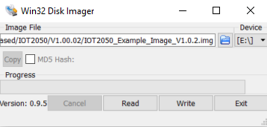|
|8.|Click the “Write” button|
|||
|9.|Confirm the warning message|
||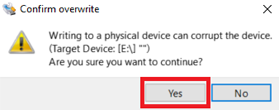|
|10.|You will receive a success message if the transfer is done|
|||
|11.|Right click on “Safely Remove Hardware and Eject Media” - Choose the SD Card|
||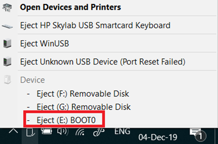|
|12.|Insert the μSD-Card into the μSD-Card Slot of the SIMATIC IOT2050 as follows: 1. Open the card cover on the bottom. 2. Push the Micro SD card/Nano SIM card correctly into the supporting frame. The contacts of the Micro SD card/NanoSIM card must point in the direction of the motherboard. 3. Push the card cover back.|
||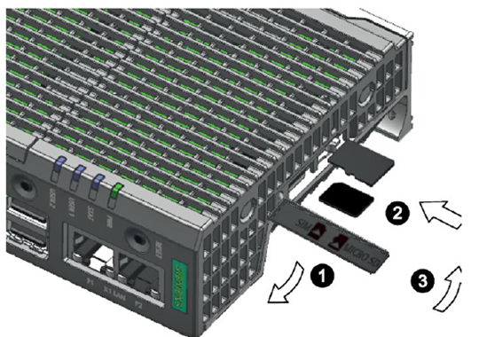|

### **3.2 First commissioning of the SIMATIC IOT2050**

**Connect to a power supply:** The following table shows how to connect the SIMATIC IOT2050 to a power supply.

Table 3-2

|No.|Action|
|:-:|-|
|1.|Power off the power supply|
|2.|Connect the cable to the connecting terminal|
|3.|Connect the connecting terminal to the SIMATIC IOT2050|
|4.|Power on the power supply|
| ||

>**CAUTION:** Only use a DC 12...24V power supply!

#### **3.2.1 Local access**

The following table shows how to connect the SIMATIC IOT2050 using a DisplayPort supported monitor via DisplayPort cable and a keyboard.

Table 3-3

|No.|Action|
|:-:|-|
|1.|Connect one end of the DisplayPort cable to a Display-Port of the monitor|
|2.|Connect the other end of the DisplayPort cable to the Display-Port of the SIMATIC IOT2050.|
|3.|Connect a keyboard to USB port of SIMATIC IOT2050|

#### **3.2.2 Remote access with Putty SSH Connection**

**Ethernet cable:** The following table shows how to connect the SIMATIC IOT2050 and the engineering station with an Ethernet cable.

Table 3-4

|No.|Action|
|:-:|-|
|1.|Connect one end of the Ethernet cable to an Ethernet-Port of the Engineering Station.|
|2.|Connect the other end of the Ethernet cable to the Ethernet-Port X1P2 of the SIMATIC IOT2050.|

The Software “Putty” can be used to get remote access from the Engineering Station to the SIMATIC IOT2050 via Serial, SSH or Telnet.

In this Example the SSH connection is used.

**NOTE:** The SIMATIC IOT2050 has a static IP address by default. This address is 192.168.200.1. The Engineering Station has to be in the same subnet as the SIMATIC IOT2050 to establish a SSH connection!

**NOTE:** The first boot may last a few minutes – up to 2 – because the filesystem is resized automatically. The time is depending on the SD card you are using.

The following table shows how to use Putty.

Table 3-5

|No.|Action|
|:-:|-|
|1.|Open downloaded Putty.exe with double-click|
|||
|2.|Configure the connection as follows: **1.** Choose the Connection Type “SSH” **2.** Enter the IP address 192.168.200.1 **3.** The port is 22 by default **4.** This configuration can be saved as Default Settings (Mark Default Settings and press the “Save” Button|
|||
|3.|Click on “Open” button for opening the communication to the SIMATIC IOT2050 via SSH.|
||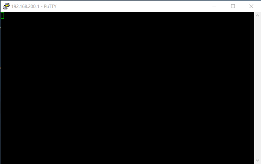|
|4.|Connecting the first time via SSH a Warning dialog will appear. It is necessary to update the SSH key. Press the “Yes” button.|
||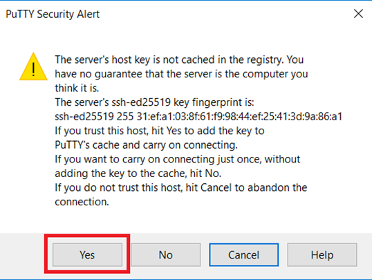|
|5.|If once confirmed a login dialog appears|
||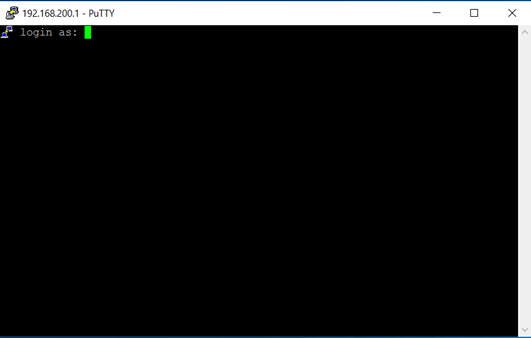|
|6.|Type “root” and press the Enter key. Type “root” for the password and Enter key. You are prompted to change the root password at the first login|
|||
|7.|Change the password for the login “root: **1.** Type in the current password (“root”) **2.** Set a new password (input is hidden) **3.** Confirm the password (input is hidden)|
||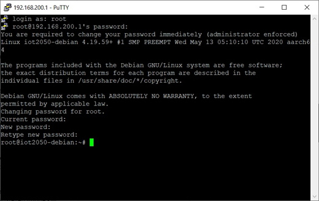|
|8.|Now a few Linux commands can be tested. For example, “cd /” to get in the root file system and “ls” to list the folders in the current directory|
|||
|9.|To create another user type “adduser” and the name of the user you want to add. Enter password for the user.|
||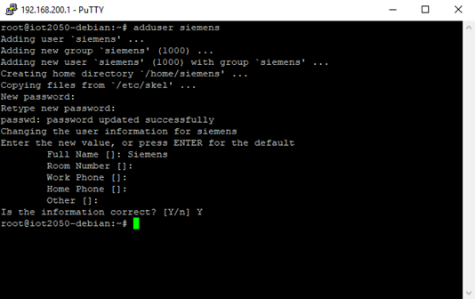|
|10.|You can add the user to sudo group by typing “adduser siemens sudo”|
||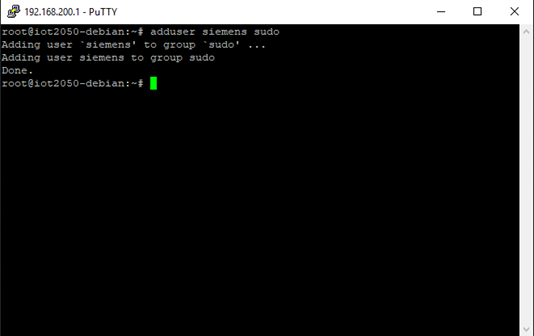|

#### **3.2.3 Setting up network interfaces**

In the default settings of the SIMATIC IOT2050’s Image, the IP address is set to 192.168.200.1. Thus, if another static IP address or a DHCP address is required, this can be set with the nmtui tool.
The following table displays the procedure for configuring the IP address settings.

Table 3-6

|No.|Action|
|:-:|-|
|1.|Open a valid serial Putty connection and login as root|
|2.|Type in “nmtui” to open the network manager tool, navigate to “Activate a connection” and press “Enter”|
||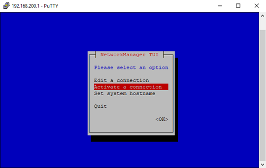|
|3.|Select the interfaces to active. eth0 is activated as default. eth1 is deactivated as default.|
|||
|4.|You can edit the IP addresses of your interfaces from “Edit a connection”.|
||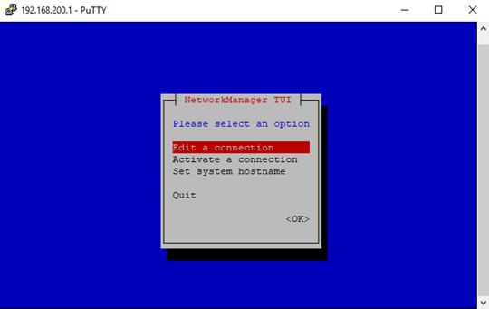|
||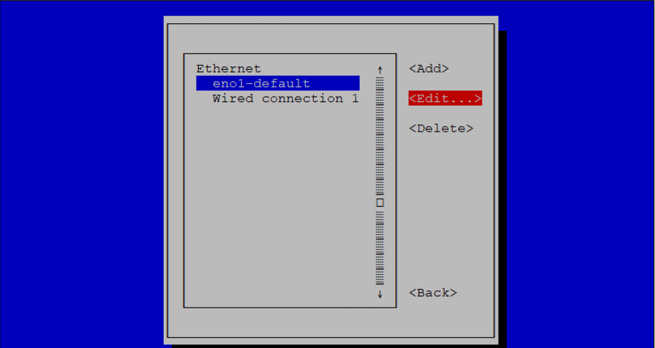|
||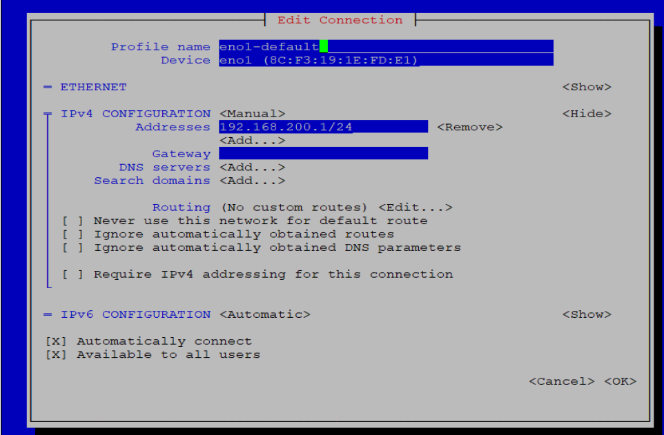|
|5.|You can connect the IOT2050 to Wireless Access Point via USB Wifi Dongle. Insert your USB wifi dongle to IOT2050 and go to “Activate a connection” and select the Wireless AP to connect and provide the password.|
|||
|||
|6.|To make changes in your Wireless Connection, go to “Edit a connection”. Here you can make all the changes you needed.|
|||

#### **3.2.4 Install new software packages on the SIMATIC IOT2050**

Provided example image includes apt package manager so that by using apt package manager new software can be installed on SIMATIC IOT2050.

The following table shows how to install new software packages on the SIMATIC IOT2050.

Table 3-7

|No.|Action|
|:-:|-|
|1.|Open a valid serial Putty connection and login as root|
|2.|Before installing any software package, update repositories by typing “apt update”|
||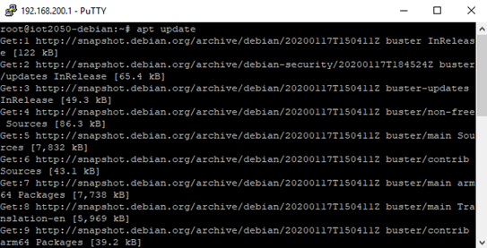|
|3.|Type “apt install \<nameofsoftware> ”. For example: install wireshark – it is a software to track network packages. Accept the licenses during installation.|
|||
|4.|Type “apt purge \<nameofsoftware\> ” to completely remove the software with its configuration file.|

---

## **4 Related links**

Table 4-1

||Topic|
|:-:|-|
|1.|SIMATIC IOT2050 forum: [https://support.industry.siemens.com/tf/ww/en/threads/309](https://support.industry.siemens.com/tf/ww/en/threads/309)|
|2.|Download SD-Card Example Image: [https://support.industry.siemens.com/cs/ww/en/view/109780231](https://support.industry.siemens.com/cs/ww/en/view/109780231)|
|3.|Operating Instructions: [https://support.industry.siemens.com/cs/ww/en/view/109779016](https://support.industry.siemens.com/cs/ww/en/view/109779016)|
